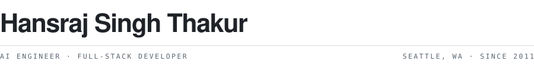
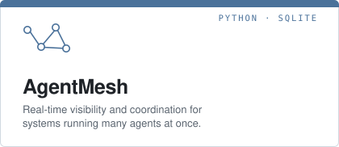
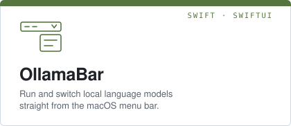
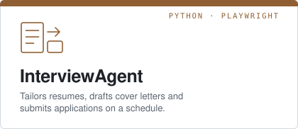
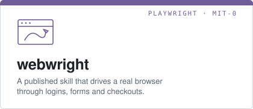

<a href="https://hansraj-portfolio-five.vercel.app/">
  <picture>
    <source media="(prefers-color-scheme: dark)" srcset="assets/wordmark-dark.svg">
    
  </picture>
</a>

I build software end to end. Embedded systems and data platforms for the first decade;
agents, voice interfaces and macOS apps for the last two. Everything in public.

[Portfolio](https://hansraj-portfolio-five.vercel.app/) ·
[LinkedIn](https://linkedin.com/in/hansraj316) ·
[Email](mailto:hansraj136@gmail.com)

## Currently building

<a href="https://github.com/hansraj316/agentmesh"><picture><source media="(prefers-color-scheme: dark)" srcset="assets/card-agentmesh-dark.svg"></picture></a>
<a href="https://github.com/hansraj316/OllamaBar"><picture><source media="(prefers-color-scheme: dark)" srcset="assets/card-ollamabar-dark.svg"></picture></a>
<a href="https://github.com/hansraj316/InterviewAgent"><picture><source media="(prefers-color-scheme: dark)" srcset="assets/card-interviewagent-dark.svg"></picture></a>
<a href="https://clawhub.ai/hansraj316/webwright"><picture><source media="(prefers-color-scheme: dark)" srcset="assets/card-webwright-dark.svg"></picture></a>

Install the browser skill with `openclaw skills install webwright`.

Also in the open: [voice-agent-carnival](https://github.com/hansraj316/voice-agent-carnival),
[cloud-arch-marketplace](https://github.com/hansraj316/cloud-arch-marketplace),
[claude-agent-sdk-learning](https://github.com/hansraj316/claude-agent-sdk-learning),
[sdd-grader](https://github.com/hansraj316/sdd-grader).

## Track record

| Years | What I worked on |
| --- | --- |
| 2024– | Agents, voice interfaces and macOS tools. Building in public. |
| 2022–2024 | Retrieval across 108 data sources, replacing manual legal review. $50M saved annually. |
| 2018–2022 | A 45TB data platform serving 1.1M users across 130 markets. |
| 2015–2018 | Enterprise applications across three regions. Led teams of 20. |
| 2011–2015 | Line-of-business apps, data lakes, embedded systems, Kinect. |

Hyderabad → Redmond → Seattle.

## Tools I reach for

- **Languages** — Python · TypeScript · Swift · SQL
- **Web** — Next.js · React · Node · Tailwind · Vercel
- **Native** — SwiftUI · macOS · iOS
- **Data** — PostgreSQL · Supabase · Databricks · SQL Server
- **Models and automation** — Claude · OpenAI · MCP · Playwright

## Background

- B.E. Computer Science — Osmania University
- Microsoft Certified: DP-600 Fabric, DP-200 & DP-201 Azure Data Solutions, Azure Data Engineer Associate
- PMI-ACP
